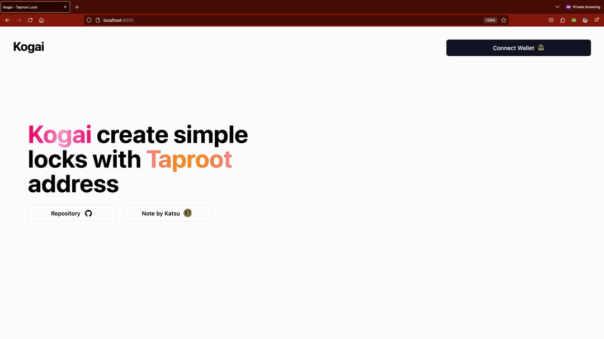

# Kogai

[](https://twentyone.world)
[](https://github.com/krutt/kogai/blob/master/LICENSE)
[](https://github.com/krutt/kogai)
[](https://github.com/krutt/kogai)
[](https://github.com/krutt/kogai)
[](https://github.com/krutt/kogai)

[](https://github.com/krutt/kogai/blob/master/static/kogai-banner.svg)

## Prerequisites

* python (3.8+) - High-level general-purpose programming language largely available on POSIX systems
* [pip](https://pypi.org/project/pip) - package installer for Python
* [poetry](https://python-poetry.org) - Python packaging and dependency management made easy
* [node](https://nodejs.org) - Run JavaScript Everywhere
* [pnpm](https://pnpm.io) - Fast, disk space efficient package manager
* [libsecp256k1](https://github.com/bitcoin-core/secp256k1) - Optimized C Library for EC operations on curve secp256k1
* [docker](https://docs.docker.com/get-docker) - Accelerated container application development
* [ aesir](https://github.com/krutt/aesir) - CLI used for setting up local Bitcoin &amp; Lightning regtest
* Web browser of choice (Chrome or Firefox)
  * [ Chrome](https://www.google.com/chrome)
  * [ Firefox](https://www.mozilla.org/en-US/firefox/new)
* Alby - Bitcoin Lightning Wallet & Nostr <sup>[*]</sup> 
  * [ Add extension to Chrome](https://chromewebstore.google.com/detail/alby-bitcoin-wallet-for-l/iokeahhehimjnekafflcihljlcjccdbe)
  * [ Add extension to Firefox](https://addons.mozilla.org/en-US/firefox/addon/alby/s)

<sup>*</sup>See why Alby and not Leather, Unisat or Xverse [here](#why-alby)

## Getting started

[](https://github.com/krutt/kogai/blob/master/static/kogai.gif)

You can set up `kogai` sandbox simply by setting up your local Python environment via Poetry as such

```sh
pip install -U poetry
poetry install
poetry shell
```

<details>
<summary> Python dependency installation steps on POSIX shell </summary>

```sh
$ pip install -U poetry
> ...
> Downloading xxx-X.X.X-py3-none-any.whl (X.X kB)
> Downloading xxx-X.XX-py3-none-any.whl (XXX kB)
>    ━━━━━━━━━━━━━━━━━━━━━━━━━━━━━━━━━━━━━━━━ 117.6/117.6 kB 9.2 MB/s eta 0:00:00
> Installing collected packages: ...
> ...
$ poetry install
> Installing dependencies from lock file
> 
> ...
> Installing the current project: kogai (0.0.1)
$ poetry shell
> Spawning shell within ...
> emulate bash -c '. /path/to/shell'
```
</details>

Since the front-end of this application will be managed by Node local envionment as well, it is
recommended to have `node` and `pnpm` package manager installed. And then install project's
javascript dependencies with the following command:

```sh
pnpm install
```

<details>
<summary> Node dependency installation steps on POSIX shell </summary>

```sh
$ pnpm install
> ++++++++++++++++++++++++++++++++++++++++++++++++++++++++++++++++++++++++++++++++++++++++++++
> Progress: resolved 224, reused 173, downloaded 14, added 187, done
> node_modules/.pnpm/vue-demi@0.14.8_vue@3.4.29/node_modules/vue-demi: Running postinstall
> script, done in 132ms
> node_modules/.pnpm/esbuild@0.21.5/node_modules/esbuild: Running postinstall script,
> done in 299ms
> 
> dependencies:
> + @vitejs/plugin-vue 5.0.5
> + autoprefixer 10.4.19
> + class-variance-authority 0.7.0
> + clsx 2.1.1
> + lucide-vue-next 0.394.0 (0.395.0 is available)
> + prettier 3.3.2
> + radix-vue 1.8.3
> + tailwind-merge 2.3.0
> + tailwindcss 3.4.4
> + tailwindcss-animate 1.0.7
> + vite 5.3.1
> + vite-svg-loader 5.1.0
> + vue 3.4.29
> 
> Done in 6.1s
```
</details>

And finally, you must also be able to do Elliptic Curve operations on your local environment as well
This is done by installing Bitcoin Core's C library `libsecp256k1`. Steps to build on POSIX systems
or perhaps Windows environment can be found on the official GitHub [Repository](https://github.com/bitcoin-core/secp256k1#building-on-posix-systems)

<details>
<summary> Libsecp256k1 installation steps on POSIX shell </summary>

```sh
$ git clone git@github.com:bitcoin-core/secp256k1.git && cd secp256k1
$ mkdir build && cd build
$ cmake ..
$ cmake --build .
$ ctest  # run the test suite
$ sudo cmake --build . --target install  # optional
```
</details>

If you had never set up a local Regtest environment before, Krutt created an easy to use command-line
interface called [Aesir](https://github.com/krutt/aesir) usable on the terminal for setting up
a local Bitcoin &amp; Lightning regtest node set-up easily rinse-and-repeatable via few simple commands
as such.

```sh
poetry install --with dev  # aesir defined in development dependencies already.
# OR
pip install aesir
```

<details>
<summary> Aesir installation steps on POSIX shell </summary>

```sh
$ kogai ❯ pip install aesir
> Requirement already satisfied: aesir in /path/to/pyenv/python3.12/site-packages (0.4.2)
> Requirement already satisfied: APScheduler
> Requirement already satisfied: click
> Requirement already satisfied: docker
> Requirement already satisfied: pydantic
> Requirement already satisfied: ...
> Requirement already satisfied: ...
> Requirement already satisfied: certifi
```
</details>

And deploy a local cluster with just one command. If you're lucky enough not to run into this one
unresolved [issue](https://github.com/docker/docker-py/issues/3059) on `docker-py` github repository
on macOS terminal. Steps to fix this and deploy successfully will be detailed below.

```sh
aesir deploy
```

<details>
<summary> Bypassing docker-py issue and deploy local Bitcoin &amp; Lightning cluster </summary>

```sh
$ kogai ❯ aesir deploy
> Unable to connect to docker daemon.
$ kogai ❯ sudo ln -s "$HOME/.docker/run/docker.sock" /var/run/docker.sock
> Password:
$ kogai ❯ aesir deploy
> Deploy duo cluster:                    ━━━━━━━━━━━━━━━━━━━━━━━━━━━━━━━━━━━━━━━━ 100% 0:00:00
> Deploy shared-volume peripherals:      ━━━━━━━━━━━━━━━━━━━━━━━━━━━━━━━━━━━━━━━━ 
```
</details>

And finally serve the local web application and visit `http://127.0.0.1:8000` on your preferred 
internet browser with Alby Bitcoin & Lightning Wallet extension installed.

```sh
uvicorn serve:app
```

<details>
<summary> Uvicorn ASGI Web Server running </summary>

```sh
$ kogai ❯ uvicorn serve:app
> v3.12.0 (kogai-py3.12) 
> INFO:     Started server process [44832]
> INFO:     Waiting for application startup.
> INFO:     ⚡Serving Rizzler dev-server…
> INFO:     Application startup complete.
> INFO:     Uvicorn running on http://127.0.0.1:8000 (Press CTRL+C to quit)
> INFO:     
> INFO:     > kogai-frontend@0.0.1 dev /Users/mackasitt/workspaces/kogai
> INFO:     > vite
> INFO:     
> INFO:     
> INFO:     VITE v5.3.1  ready in 698 ms
> INFO:     
> INFO:     ➜  Local:   http://localhost:5173/
> INFO:     ➜  Network: use --host to expose
> INFO:     ➜  press h + enter to show help
```
</details>

### Package manager overrides

Add the following code sections to your local `serve.py` if you had other node package manager
installed and do not use `pnpm`

<details>
<summary>Override Rizzler command with `Npm`</summary>

  ```python
  from rizzler import Rizzler
  from typing import List, Tuple
  ...
  @Rizzler.load_config
  def rizzler_settings () -> List[Tuple[str, str]]:
    return [("command", "npm")]
  ```
</details>

<details>
<summary>Override Rizzler command with `Yarn`</summary>

  ```python
  from rizzler import Rizzler
  from typing import List, Tuple
  ...
  @Rizzler.load_config
  def rizzler_settings () -> List[Tuple[str, str]]:
    return [("command", "yarn")]
  ```
</details>

## Why Alby

The original intention for this project was to make scripting approachable to degens and plebs
alike. All the popular wallet extensions were tried but Alby for two main reasons. Alby wallet
extension can be switched to `regtest` network with ease and does not prominently steer its users
toward subscribing to blockchain data. Krutt encourages specifications for wallet extensions laid
out under the [WebBTC Specs](https://webbtc.dev)

### Anti-Patterns found in popular wallet extensions

* Prominent token promotion: While definitions for `Bitcoin L2` becomes more and more profitable to
  obscure, tokens like `STX` are not recognized largely as one. This prominent promotion in extension
  storefront and homepage incur choice-conundrum for users with lesser alternatives and is not
  encouraged by Krutt and team. Lightning with its long-standing history with Bitcoin does not incur
  the same cost as it is always encouraged for node-runners to attach their own sources of truths
  for blockchain data.
* API-reliance: All ordinals-focused wallet extensions rely on making API calls to individual API 
  servers preventing pure JSON-RPC calls to Bitcoin Nodes.
* Regtest not supported: This is a continuation for the previous fault. Due to heavy-reliance on API
  access, there can never be a singular `regtest` network.

## What Alby lacks (circa Jun 2024)

According to the [WebBTC Specs](https://webbtc.dev), it would be nice if `window.webbtc.sendPayment`
can also be implemented by Alby Wallet Extension as well. The current state of this sandbox requires
a hand-off to the server sending `0.1 BTC` to the lock contract and can be improved if `sendPayment`
is implemented according to the WebBTC specs.

For those interested, instead of the original specs, feel free to follow along with
[Alby Docs on WebBTC](https://guides.getalby.com/developer-guide/v/alby-browser-extension-apis/window.webbtc)
for your implementation which diverged some time ago for simplicity and minimalism. Hopefully we
will see more self-sovereign methods that allow for broadcasting to a node selection menu as well.
For example, self-sovereign method like Signing Partially-Signed Bitcoin Transaction is supported.

## Contributions

To be determined;

## License

This project is licensed under the terms of the MIT license.